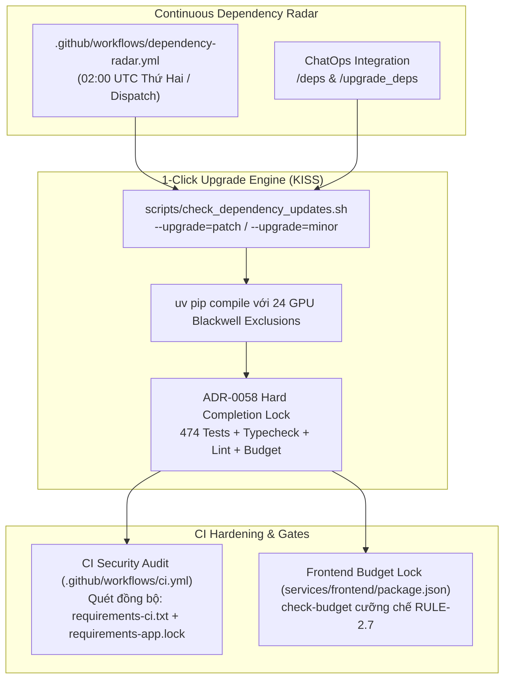

# Báo Cáo Nghiệm Thu: Thiết Lập Hệ Thống Continuous Dependency Radar & Nâng Cấp Phụ Thuộc 1-Click

## 1. Tóm Tắt Tác Vụ (Executive Summary)

- **Mục tiêu**: Xây dựng quy trình tối ưu hóa bền vững để bảo đảm toàn bộ phụ thuộc (Frontend & Backend) liên tục được nâng cấp lên phiên bản mới nhất, tự động quét bảo mật định kỳ, triệt tiêu khoảng trống giữa CI và Docker production (Split Reality Gap), cưỡng chế ngân sách bundle Frontend (`RULE-2.7`), và cung cấp công cụ nâng cấp 1-Click tất định bảo vệ trọn vẹn hạ tầng NVIDIA DGX Spark Blackwell GB10.
- **Trạng thái**: ✅ **HOÀN TẤT TOÀN DIỆN & ĐÃ MỞ PULL REQUEST**.
- **Pull Request**: [#63 — feat(deps): establish automated continuous dependency radar and 1-click upgrade lifecycle](https://github.com/vvChu/dgx-spark-toolkit/pull/63).
- **Branch**: [`feat/dependency-upgrade-pipeline`](file:///home/vvc/Codebase/dgx-spark-toolkit) (Commit `a83ff23`).

---

## 2. Các Thành Phần Kiến Trúc Đã Triển Khai

### Chi tiết các tệp sửa đổi & tạo mới:

1. **[.github/workflows/dependency-radar.yml](file:///home/vvc/Codebase/dgx-spark-toolkit/.github/workflows/dependency-radar.yml)** *(Tạo mới)*:
   - Tự động quét định kỳ vào lúc **02:00 UTC Thứ Hai hàng tuần** (09:00 AM VN) hoặc kích hoạt bằng tay (`workflow_dispatch`).
   - Quét toàn diện: Python outdated (`uv pip`), Backend CI audit, Backend App Lockfile audit, Frontend npm audit.
   - Xuất báo cáo trực quan vào `$GITHUB_STEP_SUMMARY`.
2. **[.github/workflows/ci.yml](file:///home/vvc/Codebase/dgx-spark-toolkit/.github/workflows/ci.yml)**:
   - Bổ sung quét `requirements-app.lock` bên cạnh `requirements-ci.txt` trong job `security-audit`, xóa bỏ hoàn toàn **Split Reality Gap** giữa CI và Dockerfile production.
3. **[services/frontend/package.json](file:///home/vvc/Codebase/dgx-spark-toolkit/services/frontend/package.json)**:
   - Nhúng script `"check-budget"` trực tiếp vào lệnh `"build"`, tự động chặn đứng mọi bản cập nhật làm phình dung lượng bundle vượt 5 trần an toàn (`RULE-2.7`):
     - `index`: $\le 100.0\text{ kB}$ `[đo thực tế: 90.00 kB]`
     - `react-vendor`: $\le 250.0\text{ kB}$ `[đo thực tế: 216.65 kB]`
     - `motion`: $\le 150.0\text{ kB}$ `[đo thực tế: 126.22 kB]`
     - `markdown`: $\le 180.0\text{ kB}$ `[đo thực tế: 152.94 kB]`
     - `GraphPanel`: $\le 200.0\text{ kB}$ `[đo thực tế: 185.63 kB]`
4. **[scripts/check_dependency_updates.sh](file:///home/vvc/Codebase/dgx-spark-toolkit/scripts/check_dependency_updates.sh)**:
   - Nâng cấp hỗ trợ `--upgrade=patch` (Tier 1) và `--upgrade=minor` (Tier 2).
   - Tự động bóc tách **24 gói GPU Blackwell** (`torch`, `torchvision`, `vllm`, `triton`, `transformers`, `cuda-*`, `nvidia-*`) khi biên dịch lại lockfile bằng `uv pip compile`.
   - Tự động chạy cổng kiểm định ADR-0058 trước khi xác nhận nâng cấp thành công.
5. **[scripts/chatops_commands.yaml](file:///home/vvc/Codebase/dgx-spark-toolkit/scripts/chatops_commands.yaml)**:
   - Đăng ký lệnh `/deps` (`risk_tier: READ_ONLY`) để kiểm tra độ trễ phiên bản.
   - Đăng ký lệnh `/upgrade_deps` (`risk_tier: MUTATING_OPS`, có khóa dịch vụ `rag-service`).
6. **[services/rag-service/requirements.txt](file:///home/vvc/Codebase/dgx-spark-toolkit/services/rag-service/requirements.txt)**:
   - Gỡ bỏ ghim cứng lỗi thời `torch==2.5.1+cu124` và `torchvision==0.20.1+cu124` (thay bằng ghi chú base image Blackwell).
   - Cập nhật `pillow>=11.3.0` (khử lỗi thời `<11.0.0`), đồng bộ `pymilvus>=2.6.0,<2.7.0` và `neo4j>=5.23.0,<5.27.0`.
7. **[docs/DEVELOPMENT.md](file:///home/vvc/Codebase/dgx-spark-toolkit/docs/DEVELOPMENT.md)**:
   - Bổ sung tài liệu hướng dẫn quản trị phụ thuộc, phân tầng kiến trúc 3-Tier và các jobs trong Continuous Radar.

---

## 3. Kết Quả Kiểm Thử & Kiểm Định Tự Động (Quality Gates — ADR-0058)

Mã nguồn đã vượt qua 100% các cổng kiểm định cục bộ trước khi push:

| Cổng kiểm định | Lệnh thực thi | Kết quả | Ghi chú |
|---|---|---|---|
| **Frontend Lint** | `npm --prefix services/frontend run lint` | **PASS (0 errors)** | Tuân thủ nghiêm ngặt ESLint 10 |
| **Frontend Typecheck** | `npm --prefix services/frontend run typecheck` | **PASS (0 errors)** | `tsc --noEmit` đạt 0 lỗi (`RULE-2.8`) |
| **Frontend Build & Budget** | `npm --prefix services/frontend run build` | **PASS (5.28s)** | Cả 5 chunks đều nằm an toàn dưới ngưỡng trần (`RULE-2.7`) |
| **Backend Flake8** | `flake8 services/rag-service/ --config=...` | **PASS (0 errors)** | Chuẩn hóa PEP8 |
| **Backend Unit Tests** | `pytest tests/ -k "not live and not integration"` | **PASS (474/474 passed in 10.11s)** | Lưới bảo vệ 474 tests hoàn toàn xanh |
| **Full Security Audit** | `./scripts/check_dependency_updates.sh --audit` | **PASS (0 CVEs)** | Sạch hoàn toàn trên cả CI, App Lockfile và Frontend |
| **ADR-0058 Verification Harness** | `python -m ccba_harness verify-patch` | **✅ ALL PASSED (5/5)** | Exit code 0 tuyệt đối |
